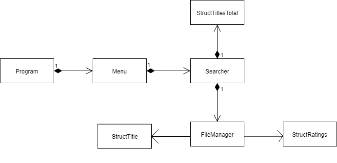

# 1º Projeto de Linguagens de Programação II 2018/2019

## Autores
Diogo Heriques, a21802132

Inácio Amerio, a21803493

João Dias, a21803573

[Repositório Git](https://github.com/FPTheFluffyPawed/lp2_2019_p1)

## Organização do trabalho

**Inácio Amerio** tratou da estrutura todo do projeto, trabalhando em todas as
classes exceto da classe `Menu.cs`. Classes como `FileManager.cs`,
`StructTitle.cs`, `StructRatings.cs`, `Searcher.cs` e `StructTitleTotal.cs`
foram trabalhadas principalmente. Tratou da otimização depois da conclusão do
projeto, lidou com os colegas o que fazer e como fazer, e tentou ensinar o
melhor possível. Finalmente, trabalhou com o João Dias na discussão e
desenvolvimento de código da classe `Searcher.cs`.

**João Dias** tratou da classe `Menu.cs`, apresentado a sua forma de como
organizar as opções e apresentou e ajudou ideias ao Inácio Amerio durante o
desenvolvimento da classe `Searcher.cs`, nas queries, nos `structs` e o
método chamado `ContainString` dentro de `Searcher.cs`.

**Diogo Henriques** tratou na parte de classificações do projeto. Tratou da
classe `Menu.cs`,  trabalhando com o João Dias, escreveu a documentação do
projeto, tratou do Doxygen, e tratou do gráfico UML. Adicionalmente,
apresentou ideias ao Inácio Amerio em como comparar os valores da
classificação.

## Descrição da solução

### Estrutura do Programa

* O nosso programa é composto por 7 classes: Searcher, Menu, Program, 
  FileManager, StructTitle, StructRatings, StructTitleTotal.
* A classe Searcher trata da pesquisa e filtragem da lista criada dentro do 
  projeto, utilizando o que foi inserido pelo utilizador para dentro da classe 
  Searcher. Aqui é onde ocorre o query de LINQ para fazer a filtragem e 
  ordenação da lista.
* A classe Menu trata da representação e navegação das opções para o utilizador, 
  chamando métodos de Searcher.
* O Program apenas chama o Menu.
* FileManager é responsável por abrir, ler e meter a informação lida dos 
  ficheiros dentro dos nossos dicionários para Titles e Ratings.
* StructTitle, StructRatings e StructTitleTotal são structs utilizadas para 
  criar as nossas bases de dados, preenchendo os construtores para adicionar aos 
  dicionários compostos por estes structs.
* Em geral, utilizamos a nossa estrutura de código pela ordem, Program para 
  Menu, Menu para Searcher, e Searcher para FileManager. Classes de dados como 
  StructTitle e StructRatings são chamadas no FileManager, enquanto 
  StructTitleTotal é utilizada no Searcher para criar a nossa base de dados 
  filtrada para mostrar depois.
* Queríamos inicialmente ter todos os nossos dados em uma struct só, adicionado
  values como a classificação e episódios mais tarde através de métodos, mas 
  como foi indicado mais tarde que era suposto usar LINQ’s join, e assim 
  acabamos por utilizar várias structs para juntar as nossas bases de dados.

### Diagrama UML

### Conclusões
* Em conclusão com este projeto, aplicar o nosso conhecimento de LINQ e de como 
  funciona a leitura de ficheiros, delegates e Dictionaries, vemos que a 
  colaboração de nós os 3 chegou a um máximo da fase 2, e mesmo assim podemos 
  aprender com este projeto para aplicar em outros. Queríamos chegar mais longe, 
  mas infelizmente não conseguimos pois nós tivemos que distribuir o nosso foco 
  para projetos diferentes que caem em datas próximas.
  
### Referências

* Utilizamos o código que o professor disponibilizou como referência para as 
  classes FileManager e Searcher.
